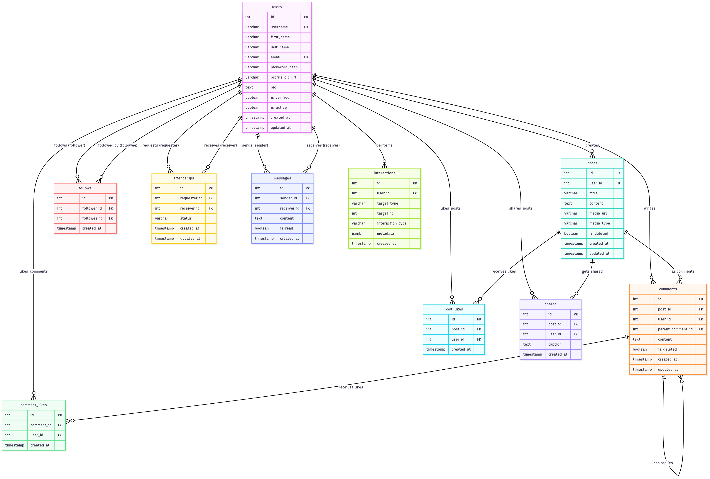

# Database Schema

## ER Diagram


## Tables
The following schema supports users, posts, interactions, and messaging.

### Table Summary

| Table | Purpose | Key Features | Relationships |
|-------|---------|--------------|---------------|
| `users` | Core user management | Authentication, profiles, verification | One-to-many with posts, comments, likes |
| `posts` | Content management | Text, media, soft deletes | Belongs to user, has many comments/likes |
| `comments` | Threaded discussions | Nested replies, soft deletes | Belongs to post/user, self-referencing |
| `post_likes` | Post engagement | Unique constraints, timestamps | Many-to-many posts/users |
| `comment_likes` | Comment engagement | Unique constraints, timestamps | Many-to-many comments/users |
| `shares` | Content amplification | Optional captions, unique shares | Many-to-many posts/users |
| `follows` | Social graph | Directional relationships | Many-to-many users (asymmetric) |
| `friendships` | Mutual connections | Status management, bidirectional | Many-to-many users (symmetric) |
| `messages` | Private communication | Read status, chronological | Many-to-many users (directed) |
| `interactions` | Analytics tracking | Flexible event system, metadata | Polymorphic relationships |

### Entity Relationships

| Relationship Type | Tables Involved | Cardinality | Description |
|-------------------|-----------------|-------------|-------------|
| **User → Content** | users → posts | 1:N | Users create multiple posts |
| **User → Content** | users → comments | 1:N | Users write multiple comments |
| **Post → Comments** | posts → comments | 1:N | Posts have multiple comments |
| **Comment Threading** | comments → comments | 1:N | Self-referencing for replies |
| **Engagement** | users ↔ posts | M:N | Likes and shares |
| **Engagement** | users ↔ comments | M:N | Comment likes |
| **Social Graph** | users ↔ users | M:N | Follows (asymmetric) |
| **Social Graph** | users ↔ users | M:N | Friendships (symmetric) |
| **Communication** | users ↔ users | M:N | Messages (directional) |
| **Analytics** | users → * | 1:N | User interactions with any entity |

### Data Types & Constraints

| Field Type | Usage | Examples | Constraints |
|------------|-------|----------|-------------|
| **SERIAL** | Primary keys | `id` columns | Auto-increment, unique |
| **VARCHAR(n)** | Text with limits | usernames, emails, titles | Length constraints |
| **TEXT** | Unlimited text | post content, bios, messages | No length limit |
| **BOOLEAN** | Flags | is_verified, is_deleted, is_read | Default values |
| **TIMESTAMP** | Date/time | created_at, updated_at | Auto-generated |
| **JSONB** | Flexible data | interaction metadata | PostgreSQL optimized |
| **UNIQUE** | Prevent duplicates | email, username, like pairs | Database enforced |
| **CHECK** | Business rules | status values, self-reference prevention | Custom validation |


### Core Tables
#### Users Table - Core User Management

```sql
-- Users table - Core user management
CREATE TABLE users (
    id SERIAL PRIMARY KEY,
    username VARCHAR(50) UNIQUE NOT NULL,
    first_name VARCHAR(50) NOT NULL,
    last_name VARCHAR(50) NOT NULL,
    email VARCHAR(100) UNIQUE NOT NULL,
    password_hash VARCHAR(255) NOT NULL,
    profile_pic_url VARCHAR(500),
    bio TEXT,
    is_verified BOOLEAN DEFAULT FALSE,
    is_active BOOLEAN DEFAULT TRUE,
    created_at TIMESTAMP DEFAULT CURRENT_TIMESTAMP,
    updated_at TIMESTAMP DEFAULT CURRENT_TIMESTAMP
);

-- Posts table - Core content management
CREATE TABLE posts (
    id SERIAL PRIMARY KEY,
    user_id INTEGER NOT NULL REFERENCES users(id) ON DELETE CASCADE,
    title VARCHAR(255),
    content TEXT NOT NULL,
    media_url VARCHAR(500),
    media_type VARCHAR(20), -- image, video, gif, etc.
    is_deleted BOOLEAN DEFAULT FALSE,
    created_at TIMESTAMP DEFAULT CURRENT_TIMESTAMP,
    updated_at TIMESTAMP DEFAULT CURRENT_TIMESTAMP
);

-- Comments table - Supports nested/threaded comments
CREATE TABLE comments (
    id SERIAL PRIMARY KEY,
    post_id INTEGER NOT NULL REFERENCES posts(id) ON DELETE CASCADE,
    user_id INTEGER NOT NULL REFERENCES users(id) ON DELETE CASCADE,
    parent_comment_id INTEGER REFERENCES comments(id) ON DELETE CASCADE,
    content TEXT NOT NULL,
    is_deleted BOOLEAN DEFAULT FALSE,
    created_at TIMESTAMP DEFAULT CURRENT_TIMESTAMP,
    updated_at TIMESTAMP DEFAULT CURRENT_TIMESTAMP
);

-- Post likes - Optimized for performance
CREATE TABLE post_likes (
    id SERIAL PRIMARY KEY,
    post_id INTEGER NOT NULL REFERENCES posts(id) ON DELETE CASCADE,
    user_id INTEGER NOT NULL REFERENCES users(id) ON DELETE CASCADE,
    created_at TIMESTAMP DEFAULT CURRENT_TIMESTAMP,
    UNIQUE(post_id, user_id) -- Prevent duplicate likes
);

-- Comment likes - Separate for better query performance
CREATE TABLE comment_likes (
    id SERIAL PRIMARY KEY,
    comment_id INTEGER NOT NULL REFERENCES comments(id) ON DELETE CASCADE,
    user_id INTEGER NOT NULL REFERENCES users(id) ON DELETE CASCADE,
    created_at TIMESTAMP DEFAULT CURRENT_TIMESTAMP,
    UNIQUE(comment_id, user_id) -- Prevent duplicate likes
);

-- Shares - Essential for social media feeds
CREATE TABLE shares (
    id SERIAL PRIMARY KEY,
    post_id INTEGER NOT NULL REFERENCES posts(id) ON DELETE CASCADE,
    user_id INTEGER NOT NULL REFERENCES users(id) ON DELETE CASCADE,
    caption TEXT, -- Optional caption when sharing
    created_at TIMESTAMP DEFAULT CURRENT_TIMESTAMP,
    UNIQUE(post_id, user_id) -- Prevent duplicate shares
);

-- Follows - Directional relationships for feeds
CREATE TABLE follows (
    id SERIAL PRIMARY KEY,
    follower_id INTEGER NOT NULL REFERENCES users(id) ON DELETE CASCADE,
    followee_id INTEGER NOT NULL REFERENCES users(id) ON DELETE CASCADE,
    created_at TIMESTAMP DEFAULT CURRENT_TIMESTAMP,
    UNIQUE(follower_id, followee_id),
    CHECK(follower_id != followee_id) -- Prevent self-following
);

-- Friendships - Mutual relationships with status management
CREATE TABLE friendships (
    id SERIAL PRIMARY KEY,
    requester_id INTEGER NOT NULL REFERENCES users(id) ON DELETE CASCADE,
    receiver_id INTEGER NOT NULL REFERENCES users(id) ON DELETE CASCADE,
    status VARCHAR(20) DEFAULT 'pending' CHECK (status IN ('pending', 'accepted', 'blocked')),
    created_at TIMESTAMP DEFAULT CURRENT_TIMESTAMP,
    updated_at TIMESTAMP DEFAULT CURRENT_TIMESTAMP,
    UNIQUE(requester_id, receiver_id),
    CHECK(requester_id != receiver_id) -- Prevent self-friendship
);

-- Messages - Private messaging system
CREATE TABLE messages (
    id SERIAL PRIMARY KEY,
    sender_id INTEGER NOT NULL REFERENCES users(id) ON DELETE CASCADE,
    receiver_id INTEGER NOT NULL REFERENCES users(id) ON DELETE CASCADE,
    content TEXT NOT NULL,
    is_read BOOLEAN DEFAULT FALSE,
    created_at TIMESTAMP DEFAULT CURRENT_TIMESTAMP
);

-- Interactions - Comprehensive analytics and activity tracking
CREATE TABLE interactions (
    id SERIAL PRIMARY KEY,
    user_id INTEGER NOT NULL REFERENCES users(id) ON DELETE CASCADE,
    target_type VARCHAR(20) NOT NULL, -- 'post', 'comment', 'user'
    target_id INTEGER NOT NULL,
    interaction_type VARCHAR(20) NOT NULL, -- 'view', 'like', 'comment', 'share', 'follow'
    metadata JSONB, -- Additional context data
    created_at TIMESTAMP DEFAULT CURRENT_TIMESTAMP
);
```